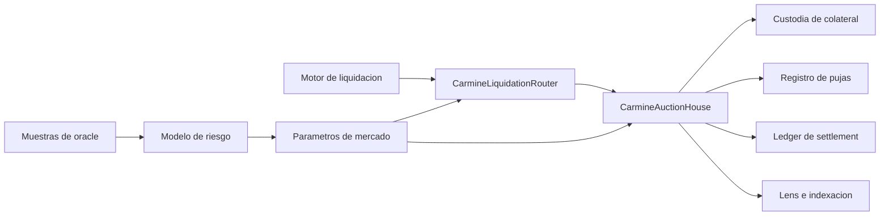
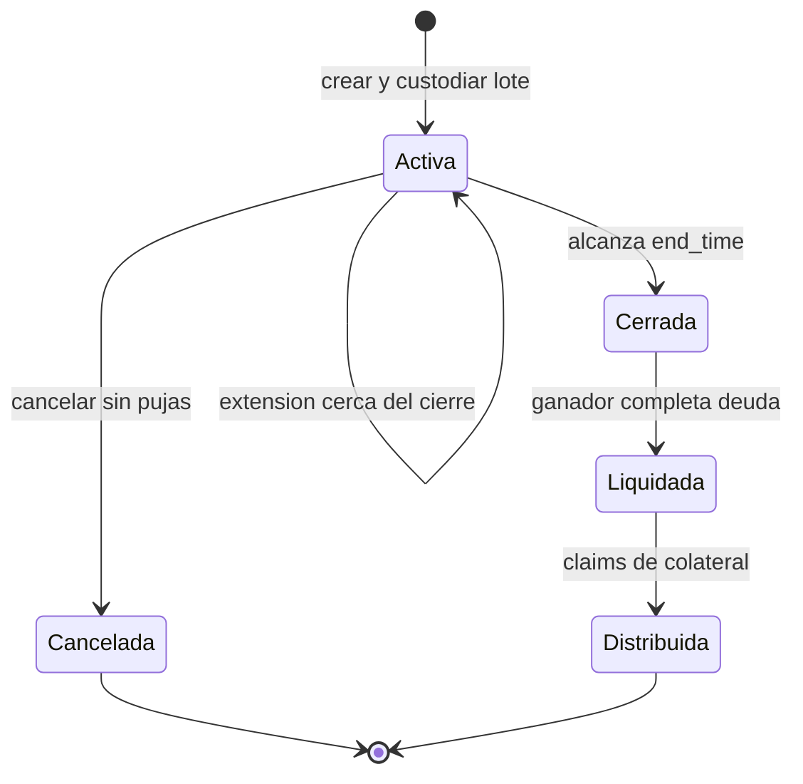
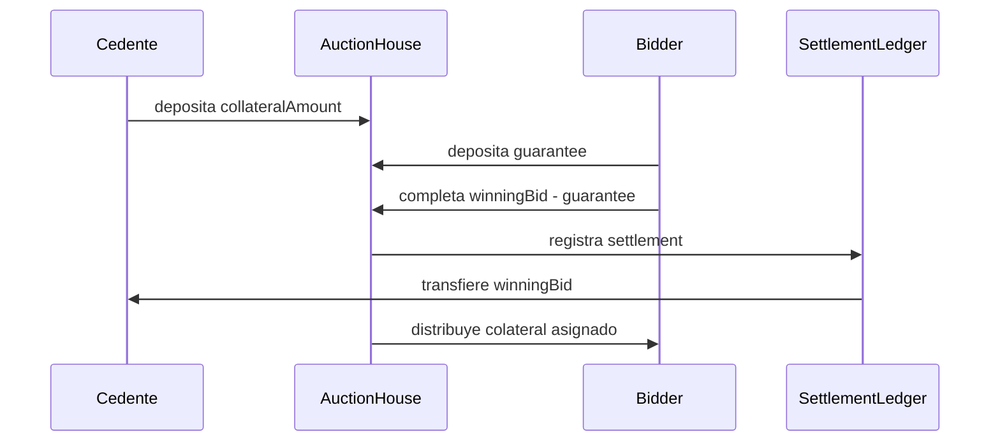
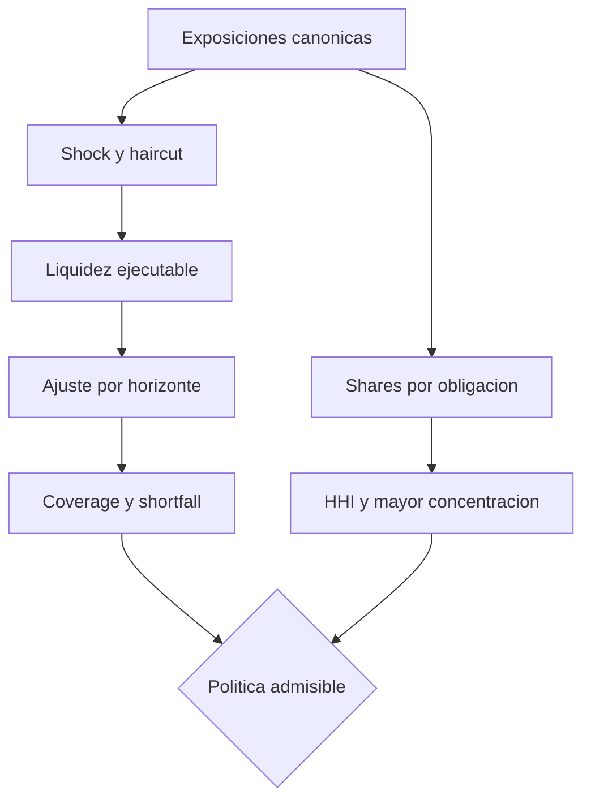
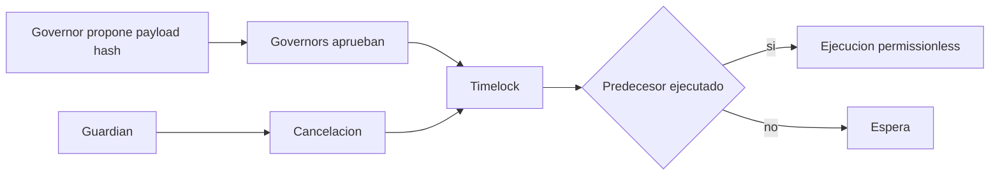

# CarmineAuctionProtocol


CarmineAuctionProtocol es una infraestructura de subastas de liquidacion para
mercados sobrecolateralizados. Coordina custodia, pujas con garantia, extension
anti-sniping, settlement de deuda, distribucion de lotes, limites de riesgo y
cambios de politica con demora verificable.

La version estable es **Production 1.0.0**. El nucleo se compila con Vyper
0.4.3; la integracion, simulacion y automatizacion operativa usan Python 3.12.

## Arquitectura



| Capa | Responsabilidad | Salida verificable |
| --- | --- | --- |
| `core/` | ciclo de subasta, custodia y settlement | estados, saldos y eventos |
| `accounting/` | historial de pujas y garantias | conciliacion por bidder |
| `risk/` | admision, descuentos y stress agregado | coverage, HHI y shortfall |
| `governance/` | parametros y cambios retardados | operaciones con quorum |
| `periphery/` | rutas por par de activos | creacion y pujas normalizadas |
| `lens/` | lectura agregada | vistas para operadores |
| `sdk/` | integracion HTTP y calculo offline | tipos fail-closed |

La descripcion completa de componentes y limites de confianza esta en
[`docs/architecture.md`](./docs/architecture.md).

## Ciclo De Una Subasta



Una puja queda admitida si supera el minimo y deposita la garantia calculada:

```text
increment = max(1, floor(winningBid * minIncrementBps / 10_000))
minimumNextBid = winningBid + increment
guarantee = max(1, floor(bidAmount * guaranteeBps / 10_000))
```

Cuando no existe puja previa, `minimumNextBid` coincide con `debtTarget`. Una
puja recibida dentro de `extensionWindow` desplaza el cierre por
`extensionDuration`. Los detalles se encuentran en
[`docs/auction-mechanics.md`](./docs/auction-mechanics.md).

## Modelo Economico



El protocolo separa tres magnitudes:

- `collateralAmount`: unidades atomicas del lote custodiado;
- `debtTarget`: recuperacion minima buscada por el cedente;
- `winningBidAmount`: deuda efectivamente pagada por el ganador.

Para `u` unidades parciales expresadas en bps:

```text
partialCollateral = floor(collateralAmount * u / 10_000)
winnerCollateral = collateralAmount - sum(partialCollateral)
unpaidSettlement = winningBidAmount - winningGuarantee
```

El detalle de balances, redondeos e indicadores esta en
[`docs/economic-model.md`](./docs/economic-model.md).

## Stress De Cartera

`CarminePortfolioStress` consolida hasta 16 mercados ordenados por identificador
canonico. Aplica shock de precio, descuento de ejecucion, profundidad de
liquidez, horizonte temporal y addon de default.

```text
stressedValue = collateralValue * (1 - shock)
executionDiscount = min(volatility + slippage, 95%)
recovery = stressedValue * (1 - executionDiscount) * liquidity
obligation = debtTarget * (1 + defaultAddon)
coverageBps = totalRecovery * 10_000 / totalObligation
HHI = sum(marketShareBps^2 / 10_000)
```



Los criterios, ejemplos numericos y runbook de escalado estan en
[`docs/portfolio-risk.md`](./docs/portfolio-risk.md).

## Gobierno Y Seguridad Operativa



`CarminePolicyTimelock` vincula dominio, chain id, target, hash del calldata,
ventana, predecesor y salt. El quorum se calcula contra governors activos en el
momento de ejecutar; retirar un rol deja de contabilizar su aprobacion. El
procedimiento completo esta en [`docs/governance.md`](./docs/governance.md).

## Instalacion

PowerShell:

```powershell
python -m venv .venv
.\.venv\Scripts\python.exe -m pip install -r requirements-dev.txt
.\.venv\Scripts\python.exe scripts\ci.py
```

Bash:

```bash
python -m venv .venv
. .venv/bin/activate
python -m pip install -r requirements-dev.txt
python scripts/ci.py
```

La validacion publica compila todos los contratos, regenera las tablas de
riesgo, ejecuta pytest, verifica formato, lint, LoC, documentacion, banner y
metadata de version.

## SDK Python

```python
from sdk import CarmineClient, atomic

client = CarmineClient(
    "https://api.carmine.example",
    api_key="runtime-secret",
    timeout_seconds=8,
)

health = client.health()
auction = client.auction(42)
quote = client.quote_bid(42, "0x" + "12" * 20, atomic("1250", 18))
receipt = client.bid(
    42,
    amount=quote.amount,
    quote_digest=quote.quote_digest,
    idempotency_key="auction-42-bid-0001",
)
```

El cliente no acepta `float`, valida todos los campos de respuesta, codifica
queries, impone timeout y usa claves de idempotencia en escrituras. Consulta
[`docs/sdk.md`](./docs/sdk.md) para el contrato de errores y los calculos
offline.

## Operacion

Antes de abrir mercado se debe comprobar:

1. tokens y decimales esperados;
2. precio fresco y limites de exposicion;
3. duracion, extension, incremento y garantia;
4. cobertura agregada bajo el escenario requerido;
5. ownership y roles de governor/guardian;
6. indexador sincronizado y saldo fisico conciliado.

Los procedimientos de apertura, vigilancia, settlement y respuesta estan en
[`docs/operations.md`](./docs/operations.md). Las comunicaciones sensibles
siguen [`SECURITY.md`](./SECURITY.md).

## Versionado

- `main` contiene el estado estable integrado.
- `production` referencia exactamente el commit publicado.
- `v1.0.0` es un tag anotado sobre ese mismo commit.
- GitHub Release se publica como `Production 1.0.0`.
- CI valida Ubuntu y Windows; el workflow de integridad vuelve a ejecutar el
  gate desde el tag.

## Licencia

MIT. Consulta [`LICENSE`](./LICENSE).
