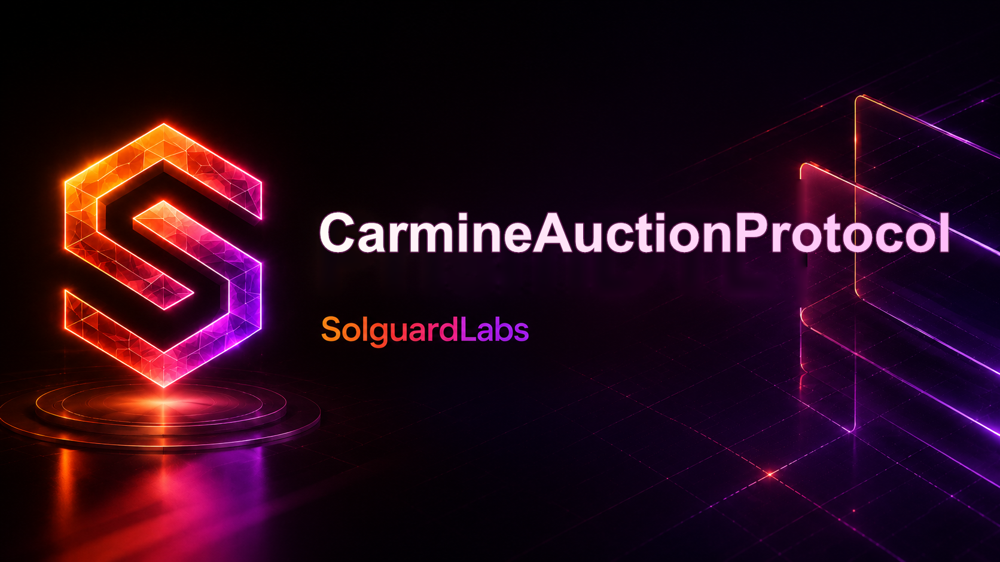

# Carmine Auction Protocol



CarmineAuctionProtocol is a Vyper liquidation-auction system for collateralized
markets. The protocol accepts seized collateral lots, collects debt-token bids,
extends auctions near close, settles proceeds to the seller, and releases
collateral to winning or entitled bidders.

## Architecture

```text
src/
  accounting/     bid-book records for bid history and refunds
  core/           auction house, collateral vault and settlement ledger
  governance/     market parameters and auction windows
  lens/           aggregate views for bidders and integrators
  mocks/          local bidder and token fixtures
  periphery/      liquidation and bidding router
  risk/           risk model and deterministic risk tables
  tokens/         mintable Vyper ERC20 fixtures for local tests
tests/
scripts/
```

## Requirements

- Python 3.11 or newer.
- Packages listed in `requirements.txt`.
- PowerShell on Windows or a Bash-compatible shell.

## Setup

```powershell
python -m venv .venv
.\.venv\Scripts\python.exe -m pip install -r requirements.txt
```

```bash
python -m venv .venv
. .venv/bin/activate
python -m pip install -r requirements.txt
```

## Validation

Run the full local CI flow:

```powershell
powershell -ExecutionPolicy Bypass -File scripts\ci.ps1
```

```bash
bash scripts/ci.sh
```

The suite validates:

- compilation of every Vyper contract in `src/`;
- auction creation and collateral custody;
- bids, outbids and bid-bond refunds;
- anti-sniping close extension;
- settlement and winner collateral claims;
- cancellation before live bidding;
- partial-claim accounting for configured bidder entitlements;
- generated risk-table consistency;
- source-size constraints for the protocol package.

## Operational Model

1. A seller creates an auction lot through the auction house.
2. Collateral is escrowed in `CarmineCollateralVault`.
3. Bidders post debt-token bids with the configured bid bond.
4. The auction extends when bids arrive close to the end of the window.
5. Settlement transfers proceeds through `CarmineSettlementLedger`.
6. Claim functions distribute collateral according to the settled auction state.

## Dependency And CI Management

GitHub Actions runs the same CI script used locally. Dependabot is configured for
Python dependencies and GitHub Actions updates on a weekly cadence.

## License

MIT.
