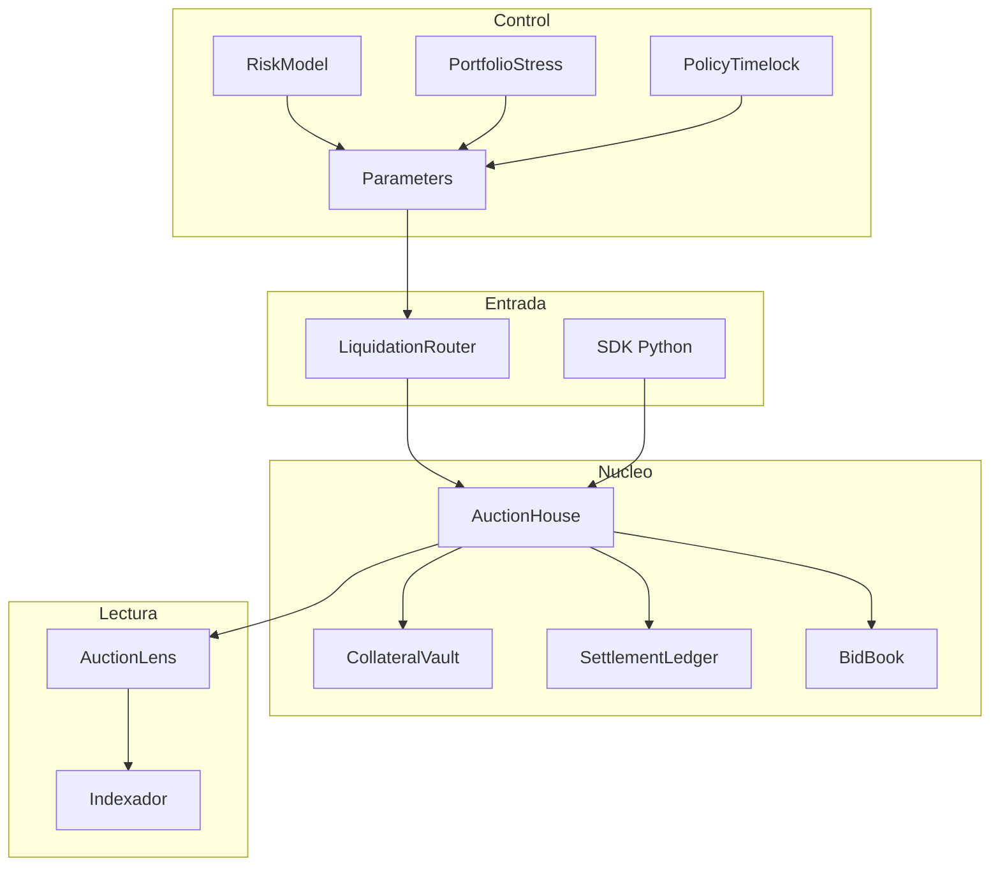

# Arquitectura Del Sistema

## Objetivo

Carmine separa admision, custodia, competencia de pujas, settlement, riesgo y
gobierno para que cada transicion pueda observarse y conciliarse de forma
independiente. El AuctionHouse es el coordinador del ciclo, pero no sustituye al
modelo de riesgo ni al plano operativo.

## Mapa De Componentes

## AuctionHouse

Mantiene una struct `Auction` por lote. Los campos se agrupan en:

- identidad: seller, tokens y `lotId`;
- economia: collateral, target, bid y guarantee;
- tiempo: inicio, cierre, extension y ultima puja;
- distribucion: unidades parciales y flags de claim;
- finality: status, settlement y cancelacion.

Las funciones de lectura exponen el minimo siguiente, garantia esperada,
proximidad al cierre, cantidades de claim y deuda pendiente.

## Custodia

`CarmineCollateralVault` permite registrar reservas por activo, depositar y
liberar cantidades contra autorizaciones explicitas. El saldo ERC-20 fisico es
la ultima fuente para determinar disponibilidad; el ledger interno sirve para
explicar obligaciones, no para inventar liquidez.

## Settlement

`CarmineSettlementLedger` conserva cada settlement con identificador monotono,
importe, auction, payer, recipient y estado. Esta capa permite comparar eventos
del AuctionHouse con flujos ERC-20 y registros de tesoreria.

## Registro De Pujas

`CarmineBidBook` almacena importe, garantia, timestamp, bidder y estado de
refund. Sus acumuladores permiten obtener medias y ratios por auction y bidder.
El libro es observabilidad; la autorizacion economica permanece en el nucleo.

## Periphery

El router asocia un par collateral/debt con una configuracion de subasta. Antes
de crear un lote transfiere el activo, aprueba el AuctionHouse y utiliza los
parametros registrados. Las rutas se pueden desactivar sin borrar su historia.

## Riesgo

`CarmineRiskModel` trabaja por mercado y calcula:

- valor y capacidad de deuda;
- umbral de liquidacion y health factor;
- target descontado por volatilidad;
- freshness de oracle;
- utilizacion y bucket de riesgo.

`CarminePortfolioStress` agrega mercados y evita que una vista local oculte un
shortfall colectivo. Los arrays deben llegar con identificadores unicos y
ordenados, lo que produce entradas deterministas.

## Gobierno

`CarmineParameters` conserva configuracion por mercado. Los cambios de alto
impacto se pueden encadenar mediante `CarminePolicyTimelock`, que compromete el
hash del calldata y exige demora, quorum vigente y predecesores ejecutados.

## Fronteras De Confianza

| Frontera | Entrada no confiable | Validacion |
| --- | --- | --- |
| bidder a house | importe, token callback | minimo, garantia, estado y tiempo |
| seller a router | lote y target | ruta activa, activos y cantidades |
| oracle a risk | precio y timestamp | valor positivo y freshness |
| governor a timelock | target y calldata | hash, dominio, delay y quorum |
| API a SDK | JSON remoto | tipos, rangos e identificadores |

## Propiedades De Diseño

1. Los identificadores se incrementan y no se reutilizan.
2. Los importes se expresan como enteros atomicos.
3. Los porcentajes usan bps con denominador 10.000.
4. Los digests comprometen dominio y contexto.
5. Las escrituras HTTP usan idempotencia.
6. Las releases se vinculan a un tag anotado.

## Dependencias

- Vyper 0.4.3 para contratos.
- web3.py y eth-tester para integracion.
- py-evm para ejecucion EVM local.
- pytest para suites funcionales.
- Ruff para formato y analisis estatico Python.

Todas las versiones estan fijadas en `requirements.txt` y
`requirements-dev.txt`.
