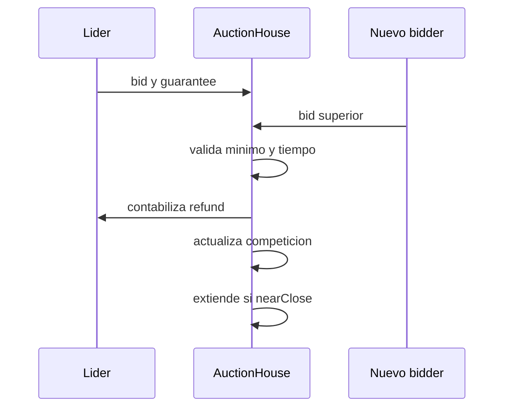

# Mecanica De Subastas

## Creacion

Una subasta requiere tokens no nulos, lote y target positivos, duracion valida,
incremento dentro de bps y garantia acotada. La creacion transfiere el
collateral al AuctionHouse antes de publicar `AuctionCreated`.

```text
startTime = block.timestamp
endTime = startTime + duration
winningBidAmount = 0
status = Active
```

El `lotId` debe derivar de un identificador de posicion o proceso estable para
que indexadores y conciliadores puedan correlacionar fuentes.

## Primer Bid

Sin lider previo:

```text
minimumNextBid = debtTarget
guarantee = max(1, floor(amount * guaranteeBps / 10_000))
```

El bidder aprueba al AuctionHouse para la garantia. El pago restante solo se
transfiere durante settlement.

## Sobrepuja

Con una puja vigente:

```text
increment = floor(winningBidAmount * minIncrementBps / 10_000)
increment = max(increment, 1)
minimumNextBid = winningBidAmount + increment
```

La garantia de la nueva puja depende de su propio importe. El libro de pujas
registra el high-water mark y el total reintegrado por bidder.

## Extension Anti-Sniping

La condicion de proximidad es:

```text
block.timestamp + extensionWindow >= endTime
```

Una puja admitida en esa zona mueve:

```text
endTime = endTime + extensionDuration
extensionCount = extensionCount + 1
```

La extension conserva el orden de pujas y evita que una transaccion del ultimo
bloque cierre sin oportunidad operativa de respuesta.



## Snapshot Parcial

Los mercados pueden configurar `partialClaimBps`. Un leader puede registrar
unidades dentro de la ventana cercana al cierre. Las unidades se expresan en
bps del lote y estan sujetas a dos limites:

```text
bidderUnits <= partialClaimBps
totalPartialUnits <= 10_000
```

La cantidad fisica se calcula solo con enteros:

```text
partialCollateral = floor(collateralAmount * unitsBps / 10_000)
```

## Cierre Y Settlement

Al alcanzar `endTime`, el ganador completa:

```text
due = winningBidAmount - winningGuarantee
```

El AuctionHouse transfiere `winningBidAmount` al seller exactamente una vez y
marca la subasta como settled.

## Distribucion

El lote se divide en:

```text
reserved = floor(collateralAmount * totalPartialUnits / 10_000)
winnerCollateral = collateralAmount - reserved
```

Cada destinatario parcial reclama una sola vez. El ganador tambien dispone de
un flag de claim final. La suma nunca debe superar el lote inicial.

## Cancelacion

El seller o el owner pueden cancelar mientras no exista puja. El collateral se
devuelve al seller y el estado pasa a cancelled. Una vez iniciada la
competicion, el cierre sigue el camino de settlement.

## Redondeos

- Los incrementos redondean hacia abajo, con minimo de una unidad.
- Las garantias redondean hacia abajo, con minimo de una unidad.
- Los claims parciales redondean hacia abajo.
- El residuo queda en la asignacion del ganador.

## Eventos A Indexar

| Evento | Clave | Uso |
| --- | --- | --- |
| `AuctionCreated` | auctionId | apertura y activos |
| `BidPlaced` | auctionId, bidder | competencia y extension |
| `PreviousBidderRefunded` | bidder | conciliacion de garantia |
| `LeaderClaimSnapshotted` | bidder | unidades reservadas |
| `AuctionSettled` | winner | pago al seller |
| `CollateralClaimed` | claimant | distribucion final |

## Checklist De Integracion

1. Leer `min_next_bid` en el bloque mas reciente.
2. Calcular garantia con el mismo denominador.
3. Confirmar allowance y saldo antes de enviar.
4. Establecer deadline operativo menor que `endTime`.
5. Releer estado despues del receipt.
6. Tratar una extension como cambio de deadline.
7. Conciliar events y saldos antes de settlement.
