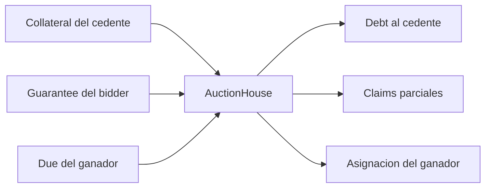

# Modelo Economico

## Unidades

Los contratos no usan coma flotante. Cada token conserva sus propios decimales
y todos los importes viajan en unidades atomicas. Los precios normalizados usan
18 decimales; los ratios, bps; los health factors, RAY de 10^27.

## Actores

- Cedente: entrega el lote y recibe deuda en settlement.
- Bidder: compite depositando garantia.
- Ganador: completa la deuda y reclama su asignacion.
- Keeper: inicia la ruta de liquidacion cuando corresponde.
- Governor: administra limites con demora.
- Guardian: puede cancelar cambios pendientes.

## Flujo De Balances



La igualdad de cierre por auction es:

```text
debtIn = winningGuarantee + due
sellerDebtOut = winningBidAmount
debtIn = sellerDebtOut
```

## Target Y Precio De Descubrimiento

`debtTarget` establece la puja inicial. El resultado puede superar el target
por competencia. El ratio de recuperacion es:

```text
recoveryBps = winningBidAmount * 10_000 / debtTarget
```

Un ratio superior a 10.000 indica excedente respecto del objetivo. Su destino
depende del sistema de deuda que origino el lote y debe conciliarse fuera del
AuctionHouse.

## Garantia De Bid

La garantia reduce el coste de abandono y adelanta parte del settlement:

```text
guarantee = floor(bidAmount * guaranteeBps / 10_000)
due = bidAmount - guarantee
```

Ejemplo:

| Concepto | Valor |
| --- | ---: |
| Bid | 1.000 cUSD |
| Guarantee bps | 2.000 |
| Guarantee | 200 cUSD |
| Due en settlement | 800 cUSD |

## Incremento Minimo

Con `minIncrementBps = 500`, una puja de 1.000 cUSD requiere al menos 1.050
cUSD. El minimo de una unidad evita que importes pequenos produzcan incremento
cero.

## Distribucion Del Lote

Para un lote de 1.000 cCOL y 3.000 bps parciales:

```text
partial = floor(1.000 * 3.000 / 10.000) = 300 cCOL
winner = 1.000 - 300 = 700 cCOL
```

El residuo de redondeo se asigna al ganador para mantener conservacion exacta.

## Valor De Colateral

```text
collateralValue = collateralAmount * normalizedPrice / 10^18
borrowCapacity = collateralValue * collateralFactorBps / 10_000
liquidationValue = collateralValue * liquidationThresholdBps / 10_000
healthFactorRay = liquidationValue * 10^27 / debt
```

Una posicion se considera liquidable si el mercado esta habilitado, la deuda
supera el minimo y el valor ajustado queda por debajo de la deuda.

## Descuento De Liquidacion

El target de auction incorpora costes de ejecucion:

```text
discount = min(
  keeperDiscountBps + volatilityBps / 10,
  maxDiscountBps
)
discountedValue = collateralValue * (10_000 - discount) / 10_000
auctionDebtTarget = min(discountedValue, debt)
```

## Indicadores De Operacion

| Indicador | Formula | Interpretacion |
| --- | --- | --- |
| bid coverage | bid / target | recuperacion relativa |
| guarantee ratio | guarantee / bid | capital adelantado |
| refund ratio | refunded / guarantees | rotacion de competidores |
| extension count | contador | presion cerca del cierre |
| claim pressure | partial / lot | reserva de distribucion |
| settlement due | bid - guarantee | pago pendiente |

## Conciliacion

Por cada auction se deben comparar:

1. balance de collateral antes y despues;
2. suma de claims y lote inicial;
3. garantias recibidas y reintegradas;
4. deuda recibida y pago al seller;
5. events de settlement y ledger;
6. flags de claim y transferencias ERC-20.

## Escenarios De Stress

El modelo agregado anade shock, volatilidad, slippage, liquidez y tiempo. El
objetivo es estimar recuperacion conservadora, no predecir precio de mercado.
Las politicas deben usar inputs documentados y conservar el digest del reporte.

## Limites

- Un oracle stale invalida decisiones basadas en precio.
- Tokens con fee, rebasing o callbacks requieren integracion especifica.
- La profundidad historica no garantiza liquidez futura.
- Los bps no capturan por si solos correlacion entre mercados.
- El resultado de una auction no reemplaza la conciliacion fisica.
