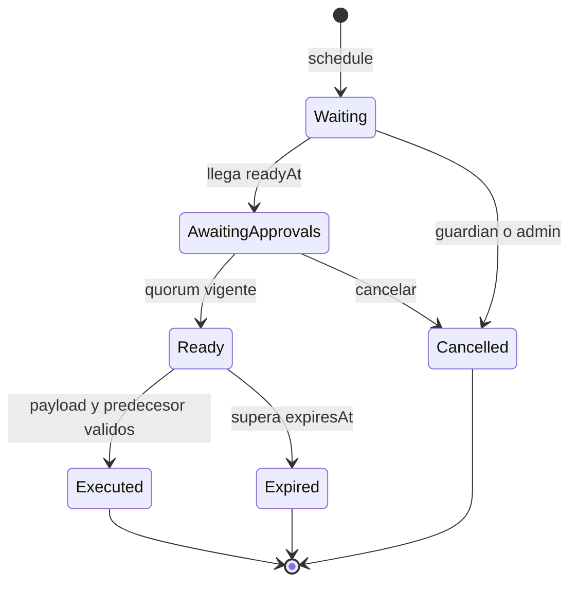

# Gobierno De Politicas

## Roles

| Rol | Facultad | Limite |
| --- | --- | --- |
| admin | governors, guardians y quorum | debe ser governor activo |
| governor | programar y aprobar | sin ejecucion anticipada |
| guardian | cancelar pendiente | no puede ejecutar |
| executor | transmitir tras readiness | permissionless |

El conjunto admite hasta 16 direcciones historicas de governor. Una direccion
revocada deja de contar de inmediato en `activeApprovalCount`.

## Identidad De Operacion

```text
operationId = keccak256(abi.encode(
  domainSeparator,
  chainId,
  target,
  callHash,
  readyAt,
  expiresAt,
  predecessor,
  salt
))
```

El `domainSeparator` distingue el plano Carmine de otros sistemas. El salt
permite programar llamadas iguales en ventanas distintas.

## Ciclo



## Programacion

El delay debe cumplir:

```text
minimumDelay <= delay <= maximumDelay
readyAt = now + delay
expiresAt = readyAt + gracePeriod
```

Se compromete el hash del calldata, no una descripcion textual. El target no
puede ser cero y una operacion no se puede programar dos veces con el mismo ID.

## Aprobaciones

Cada governor aprueba una sola vez. El contrato cuenta aprobaciones recorriendo
el conjunto actual:

```text
activeApproval = isGovernor[account] && approved[operationId][account]
```

Por tanto, una revocacion durante el timelock reduce el conteo sin necesidad de
mutar cada operacion.

## Predecesores

Una operacion puede depender de otra. La dependiente solo ejecuta si:

```text
operations[predecessor].executed == true
```

Esto permite secuencias como registrar mercado, configurar limites y habilitar
ruta sin abrir estados intermedios.

## Ejecucion

La ejecucion es permissionless cuando todos los gates se cumplen. Antes del
`raw_call`, el contrato marca la operacion como ejecutada y activa un lock de
reentrada. Si la llamada externa revierte, toda la transaccion revierte y el
estado vuelve a pendiente.

El hash del resultado se publica en `OperationExecuted` para observabilidad.

## Cancelacion

Admin y guardians pueden cancelar mientras la operacion no se haya ejecutado.
La cancelacion es final para ese ID; cualquier nueva propuesta debe usar otro
salt y recorrer de nuevo el delay.

## Procedimiento Recomendado

1. Construir calldata desde ABI versionada.
2. Verificar target, chain id y domain.
3. Simular el calldata sobre un fork controlado.
4. Calcular `callHash` independientemente.
5. Programar con salt descriptivo convertido a bytes32.
6. Publicar inputs y efecto esperado.
7. Obtener aprobaciones de governors activos.
8. Revalidar roles y estado justo antes de ejecutar.
9. Conciliar eventos y parametros despues del receipt.

## Cambios De Alto Impacto

- tokens y routes por mercado;
- factores de collateral y umbrales;
- descuentos maximos;
- ventanas de cierre y extension;
- garantia base y limites de claims;
- oracles y freshness;
- ownership de componentes.

## Respuesta Del Guardian

Cancelar cuando exista mismatch de calldata, cambio de contexto, oracle
inestable, cobertura fuera de politica, target incorrecto o perdida de quorum.
La cancelacion debe acompanarse de un registro del operation ID y razon
operativa.

## Invariantes

- Una operacion ejecutada no vuelve a ejecutarse.
- Una operacion cancelada no ejecuta.
- El payload debe coincidir exactamente con `callHash`.
- El quorum se evalua en el momento de ejecucion.
- El predecesor debe haber finalizado.
- La ejecucion ocurre dentro de la ventana.
