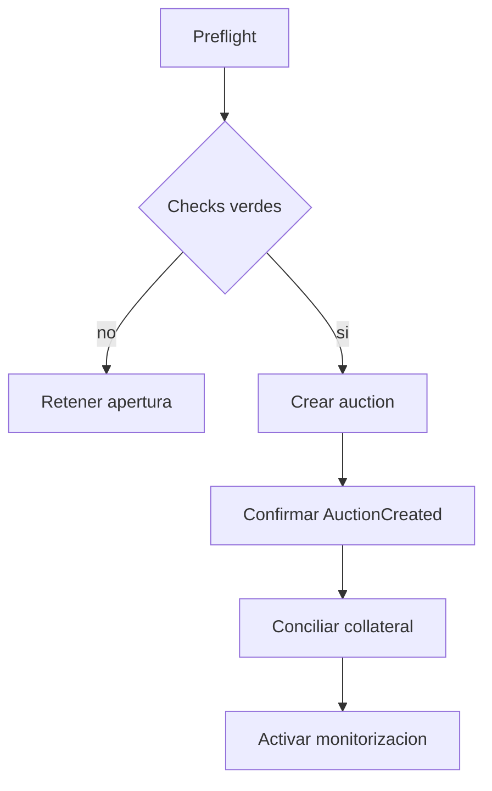

# Operacion Y Runbooks

## Entornos

| Entorno | Ref | Uso |
| --- | --- | --- |
| integracion | branch de cambio | pruebas y revision |
| estable | `main` | estado aceptado |
| production | `production` | commit publicado |
| release | tag anotado | distribucion inmutable |

`main`, `production` y el objeto pelado del tag deben resolver al mismo SHA.

## Preflight De Mercado

1. Confirmar direcciones y decimales de tokens.
2. Verificar precio positivo y timestamp fresco.
3. Revisar debt minimum, collateral factor y threshold.
4. Ejecutar stress agregado con inputs aprobados.
5. Verificar HHI y mayor exposicion.
6. Confirmar duracion y parametros anti-sniping.
7. Confirmar allowance y saldos de la ruta.
8. Archivar block number y digest.

## Apertura De Auction



Registrar auctionId, lotId, seller, tokens, collateral, target, start y end.
El saldo fisico debe reflejar el lote tras el receipt.

## Monitorizacion

Alertas recomendadas:

| Senal | Umbral |
| --- | --- |
| oracle age | mayor que `staleAfter` |
| auction sin bids | 50 % y 80 % de duracion |
| extension count | por encima de politica |
| bid jump | cambio superior al percentil esperado |
| guarantee mismatch | distinto del calculo entero |
| claim pressure | cerca de `partialClaimBps` |
| settlement overdue | endTime mas SLA |
| balance mismatch | cualquier delta no explicado |

## Settlement

Antes de transmitir:

```text
status == Active
now >= endTime
winner != zero
unpaid = winningBidAmount - winningGuarantee
allowance(winner) >= unpaid
balance(winner) >= unpaid
```

Despues:

```text
status == Settled
sellerDelta == winningBidAmount
debtSettled == true
```

## Claims

Conciliar primero unidades parciales. El ganador recibe el residuo exacto. Por
cada transferencia registrar claimant, kind, amount y transaction hash.

```text
distributed = winnerClaim + sum(partialClaims)
distributed <= collateralAmount
```

## Runbook: Oracle Stale

1. Deshabilitar nuevas routes afectadas.
2. No cambiar precios manualmente sin fuente aprobada.
3. Capturar ultimo precio, timestamp y bloque.
4. Comparar fuentes independientes autorizadas.
5. Restablecer feed y observar periodo de estabilidad.
6. Recalcular stress antes de reactivar.

## Runbook: Auction Sin Settlement

1. Verificar endTime y extensiones.
2. Confirmar winner, balance y allowance.
3. Consultar mempool y receipts del operador.
4. Notificar al bidder segun SLA.
5. Mantener el collateral inmovilizado.
6. Escalar cualquier cambio por gobierno.

## Runbook: Descuadre De Custodia

1. Pausar nuevas aperturas.
2. Capturar balances por token y reservas por auction.
3. Reprocesar events desde el ultimo bloque conciliado.
4. Separar deposits, refunds, settlement y claims.
5. Identificar el primer bloque divergente.
6. Mantener evidencia y evitar ajustes manuales opacos.

## Runbook: Operacion De Gobierno Incorrecta

1. Identificar `operationId` y estado.
2. Comparar payload con `callHash`.
3. Si esta pendiente, guardian cancela.
4. Si expiro, no reutilizar el mismo ID.
5. Preparar nueva operacion con salt distinto.
6. Repetir simulacion y aprobaciones.

## Backup Y Evidencia

Conservar:

- manifests y ABIs del tag;
- hashes de bytecode;
- configuracion por mercado;
- eventos y receipts;
- inputs y digest de stress;
- operation IDs de gobierno;
- resultado del gate de CI.

## Comandos

```powershell
.\.venv\Scripts\python.exe scripts\ci.py
.\.venv\Scripts\python.exe -m pytest tests\test_carmine_policy_timelock.py
.\.venv\Scripts\python.exe scripts\verify_repository.py
```

```bash
python scripts/ci.py
python -m pytest tests/test_carmine_portfolio_stress.py
python scripts/check_loc.py
```

## Release

1. Candidato verde en Ubuntu y Windows.
2. PR revisado y fusionado.
3. `main` verde.
4. `production` movida al SHA exacto y verde.
5. Tag anotado `v1.0.0` sobre ese SHA.
6. CI e integridad del tag verdes.
7. Release `Production 1.0.0` publicada.
8. Integridad del evento release verde.
