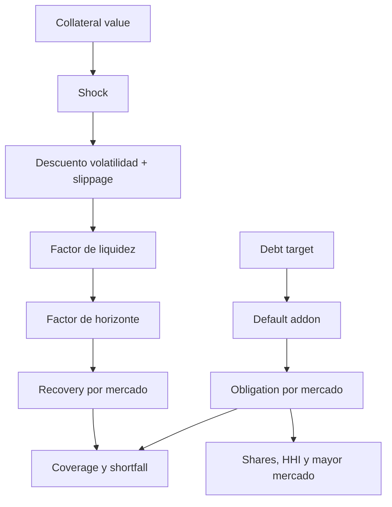

# Riesgo De Cartera

## Objetivo

`CarminePortfolioStress` evalua si el conjunto de auctions puede cubrir sus
obligaciones bajo una hipotesis conservadora. El calculo es determinista,
entero y limitado a 16 mercados por reporte.

## Entradas Por Mercado

| Campo | Unidad | Restriccion |
| --- | --- | --- |
| `marketId` | bytes32 | unico y orden ascendente |
| `collateralValue` | deuda atomica | no negativo |
| `debtTarget` | deuda atomica | mayor que cero |
| `volatilityBps` | bps | 0..10.000 |
| `liquidityBps` | bps | 0..10.000 |
| `secondsToClose` | segundos | no negativo |

Los arrays paralelos deben tener la misma longitud. El orden canonico evita que
dos operadores calculen digests distintos para la misma cartera.

## Escenario Global

- `shockBps`: caida simultanea del valor de collateral.
- `slippageBps`: descuento comun de ejecucion.
- `defaultAddonBps`: incremento prudencial de obligaciones.
- `horizonSeconds`: tiempo disponible para recuperar valor.
- `minimumCoverageBps`: limite de admision.
- `maximumHhiBps`: concentracion maxima.

## Pipeline Matematico



## Recuperacion

```text
stressed = collateralValue * (10_000 - shockBps) / 10_000
discount = min(volatilityBps + slippageBps, 9_500)
executable = stressed * (10_000 - discount) / 10_000
liquid = executable * liquidityBps / 10_000
```

Si `secondsToClose > horizonSeconds`:

```text
recovery = liquid * horizonSeconds / secondsToClose
```

La recuperacion reconocida por mercado se limita a su obligacion; el reporte no
cuenta excedente de un mercado como sustituto ilimitado de otro.

## Obligacion

```text
obligation = debtTarget + debtTarget * defaultAddonBps / 10_000
```

## Coverage

```text
coverageBps = totalRecovery * 10_000 / totalObligation
shortfall = max(totalObligation - totalRecovery, 0)
```

Un escenario es admisible si coverage supera el minimo, HHI queda bajo el
maximo y shortfall es cero.

## Concentracion

```text
shareBps_i = obligation_i * 10_000 / totalObligation
HHI = sum(shareBps_i * shareBps_i / 10_000)
```

Referencias operativas:

| HHI bps | Lectura |
| ---: | --- |
| 0..2.000 | diversificacion alta |
| 2.001..4.000 | concentracion moderada |
| 4.001..6.000 | concentracion elevada |
| 6.001..10.000 | dependencia dominante |

Los limites finales dependen de la politica aprobada, no de esta tabla
orientativa.

## Vencimiento Ponderado

```text
weightedClose = sum(obligation_i * secondsToClose_i) / totalObligation
```

Un valor alto implica que buena parte de la recuperacion depende de auctions
lejanas. Debe compararse con ventanas de oracle, runway de tesoreria y SLA de
keepers.

## Garantia Recomendada

La funcion auxiliar combina base, volatilidad y concentracion:

```text
guaranteeBps = min(
  baseBps + volatilityBps / 4 + concentrationBps / 5,
  maximumGuaranteeBps
)
```

## Ejemplo

Tres mercados aportan targets de 1.000.000, 600.000 y 400.000. Con addon del 5
%, la obligacion agregada es 2.100.000. Para cada mercado se aplican shock del
20 %, slippage del 5 %, liquidez especifica y horizonte de un dia. El reporte
devuelve coverage, shortfall, HHI, mayor share y cierre ponderado en una sola
estructura.

## Runbook De Incumplimiento

1. Congelar nuevas rutas del mercado afectado.
2. Capturar inputs, bloque y digest del reporte.
3. Separar caida de precio, liquidez y retraso temporal.
4. Confirmar saldos de vault y ledger.
5. Proponer limites mediante timelock.
6. Repetir escenario base, adverso y extremo.
7. Reactivar solo con coverage y concentracion dentro de politica.

## Supuestos

- Valores denominados en la misma deuda.
- Correlacion reflejada en el shock comun.
- Liquidez expresada como factor conservador.
- No se netean obligaciones sin derecho juridico y tecnico de compensacion.
- Los inputs quedan archivados junto al digest.
